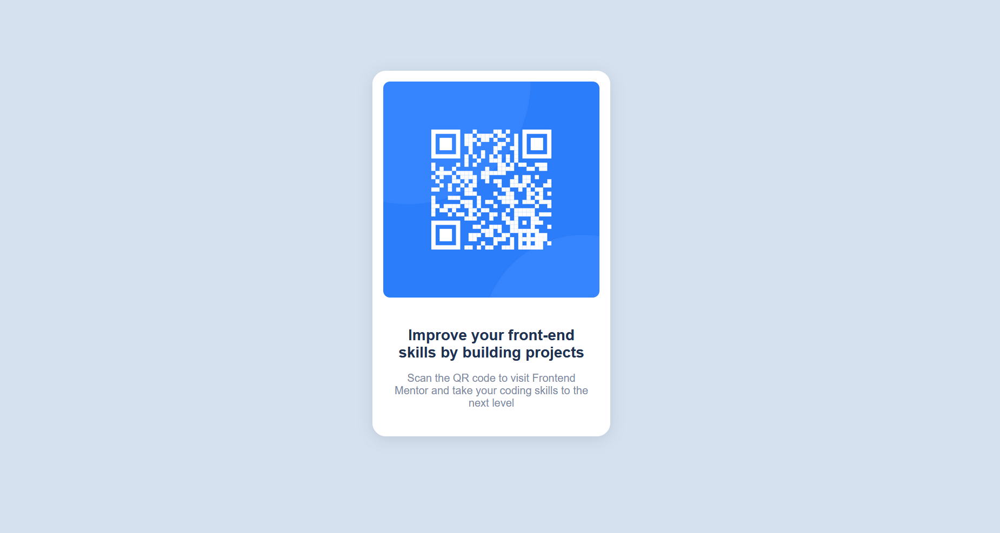

# Frontend Mentor - QR code component solution

This is a solution to the [QR code component challenge on Frontend Mentor](https://www.frontendmentor.io/challenges/qr-code-component-iux_sIO_H). Frontend Mentor challenges help myself improve my coding skills by building realistic projects. 

## Table of contents

- [Overview](#overview)
  - [Screenshot](#screenshot)
  - [Links](#links)
- [My process](#my-process)
  - [Built with](#built-with)
  - [What I learned](#what-i-learned)
  - [Continued development](#continued-development)
  - [Useful resources](#useful-resources)
- [Author](#author)
- [Acknowledgments](#acknowledgments)

## Overview

### Screenshot

### Links

- Solution URL: (https://github.com/fidelitychawadya/qr-code-component.git)
- Live Site URL: (https://fidelitychawadya.github.io/qr-code-component/)

## My process

### Built with

- Semantic HTML5 markup
- CSS custom properties
- Flexbox
- CSS Grid
- Mobile-first workflow
- [Angular] - JS Framework

### What I learned

how to create an angular project
how to create components using  CLI

### Continued development

If the Qr Code is scanned it should take me to https://www.frontendmentor.io/profile/fidelitychawadya
Make use of github actions
Add more Qr codes on the page that would be scanned to some of my articles

## Author

- Website - [Fidelity()
- Frontend Mentor - [@fidelitychawadya](https://www.frontendmentor.io/profile/fidelitychawadya)

## Acknowledgments

